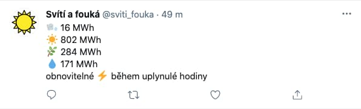

# Svítí a fouká

[Twitter bot](https://twitter.com/sviti_fouka) tvítující výrobu elektřiny z obnovitelných zdrojů v Česku za minulou hodinu z dat [ČEPS](https://www.ceps.cz/cs/data) a [entsoe](https://transparency.entsoe.eu/content/static_content/Static%20content/web%20api/Guide.html).

Vybrané obnovitelné zdroje (biomasa, slunce, vítr, část vodní) ze statistiky Aggregated Generation per Type (16.1.B&C).

Běží jako cronjob 10 7-18 * * *

Záminka pro seznámení se s Tweepy, Twitter a Endsoe API.
